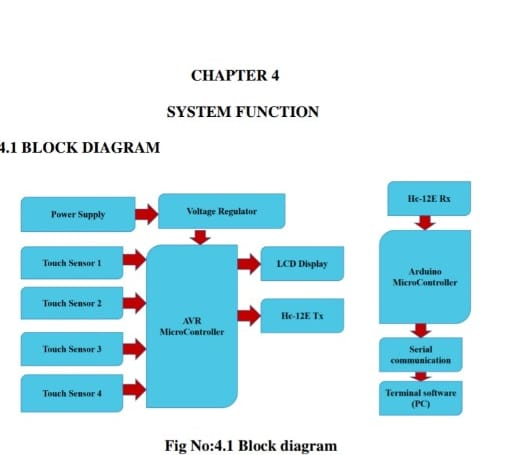
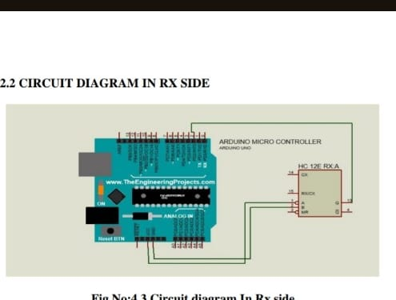
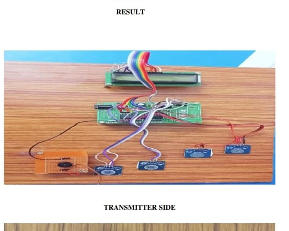
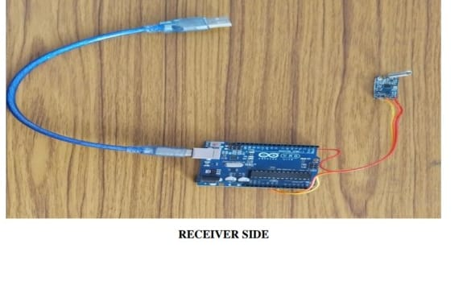

# TouchSense Food Ordering System

## Description
A touch sensor based food ordering system designed for restaurants using AVR microcontroller and HC-12 wireless communication.

## Project Overview
This project allows customers to place food orders using touch sensors. The selected order is transmitted wirelessly from the transmitter side to the receiver side.

## Block Diagram

## Transmitter Circuit Diagram

## Receiver Circuit Diagram

## Transmitter Side

## Receiver Side

